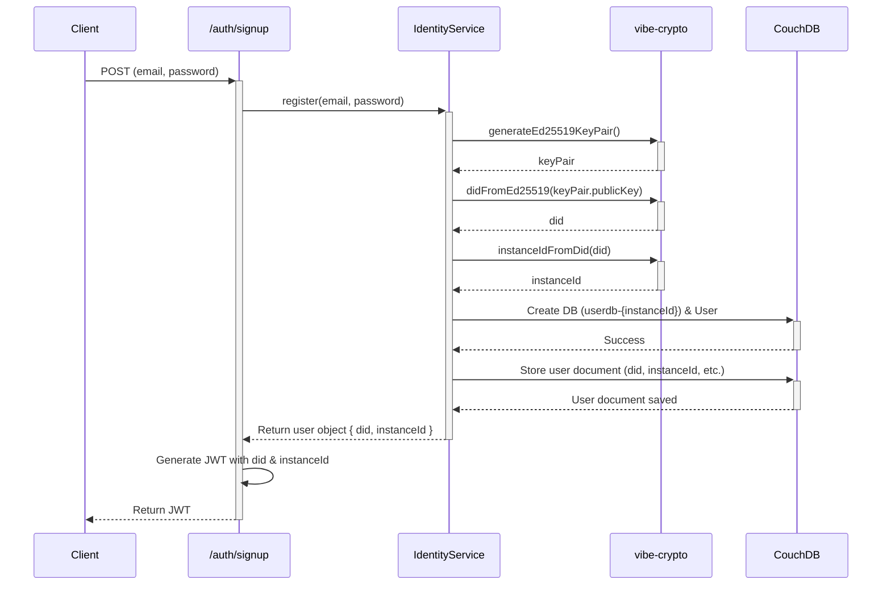

# Vibe Cloud API - Authentication and Registration Flow

This document outlines the architecture and implementation plan for updating the user registration and authentication flow in the `vibe-cloud-api`. The primary goal is to integrate Decentralized Identifiers (DIDs) and provision user-specific resources upon signup.

## 1. Consolidate Identity Logic into `vibe-crypto`

To ensure the DID and `instanceId` logic is centralized and reusable, we will place it in the `packages/vibe-crypto` shared library.

-   **Action:** Create a new file, `packages/vibe-crypto/src/did.ts`, and migrate the necessary functions: `generateEd25519KeyPair`, `didFromEd25519`, `ed25519FromDid`, and `instanceIdFromDid`.
-   **Action:** Update `packages/vibe-crypto/package.json` to include the required dependencies (`@noble/ed25519`, `multibase`, `varint`).
-   **Action:** Confirm that `apps/vibe-cloud-api/package.json` correctly references the `vibe-crypto` workspace package.

## 2. Enhance the `IdentityService`

The core registration logic will be expanded within `apps/vibe-cloud-api/src/services/identity.ts`.

-   **Action:** The `register` method within the `IdentityService` will be updated to perform the following sequence:
    1.  Generate a new `Ed25519KeyPair`.
    2.  Derive the `did` from the public key.
    3.  Derive the `instanceId` from the `did`.
    4.  Provision the user's dedicated CouchDB database (e.g., `userdb-{instanceId}`).
    5.  Create a new CouchDB user with credentials scoped specifically to that new database.
    6.  Securely encrypt and store the user's private key and their new CouchDB credentials within the user's record in the main system database.
    7.  Return the complete user object, which will now include the `did` and `instanceId`.

## 3. Update the Signup Endpoint and JWT Structure

We will modify the API layer in `apps/vibe-cloud-api/src/index.ts` to align with these changes.

-   **Action:** The JWT schema will be updated to carry the `did` (as the subject) and the `instanceId`.

    ```typescript
    // From:
    schema: t.Object({
        id: t.String(),
    }),

    // To:
    schema: t.Object({
        sub: t.String(), // Standard JWT claim for subject (user's DID)
        instanceId: t.String()
    }),
    ```

-   **Action:** The `/auth/signup` handler will be updated to sign the new JWT payload.

    ```typescript
    // From:
    const accessToken = await jwt.sign({
        id: user._id,
    });

    // To:
    const accessToken = await jwt.sign({
        sub: user.did,
        instanceId: user.instanceId,
    });
    ```

-   **Action:** All other code that verifies and uses the JWT (e.g., the `/users/me` endpoint) will be updated to reference `profile.sub` instead of `profile.id` for the user's identifier.

## Updated Flow Diagram


