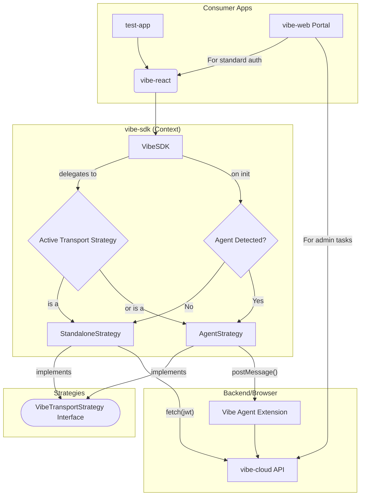

# Vibe Auth Flow and SDK Plan

This document outlines the plan for creating a self-contained and easy-to-use authentication and data interaction flow for third-party developers using the Vibe ecosystem.

## 1. Core Components

The new implementation will be centered around two main packages:

-   `vibe-sdk`: A low-level library responsible for all communication with the `vibe-cloud` API and handling the authentication logic.
-   `vibe-react`: A React-specific library that provides a `VibeProvider` context and a `useVibe` hook, making it easy to integrate the SDK into React applications.

## 2. `vibe-sdk` Architecture: The Strategy Pattern

To cleanly handle different communication methods (direct API calls vs. using the Vibe Agent), the SDK will be built using the **Strategy Pattern**.

### `VibeTransportStrategy` Interface

A central interface will define the complete contract for all backend interactions:

-   **Auth Methods:** `login()`, `logout()`, `signup()`, `getUser()`
-   **Data Methods:** `read()`, `write()`

### Concrete Strategies

Two classes will implement this interface, providing the specific logic for each mode:

1.  **`StandaloneStrategy` (Default):**

    -   `login()`: Manages the popup window flow to the `vibe-web` portal for authentication and consent.
    -   `read()`/`write()`: Makes direct, authenticated `fetch` requests to the `vibe-cloud-api` using a JWT.

2.  **`AgentStrategy`:**
    -   This strategy will be used when the Vibe Agent browser extension is detected.
    -   All methods (`login`, `read`, `write`, etc.) will be implemented by delegating the calls to the Vibe Agent's exposed API.

### `VibeSDK` (Context)

The main `VibeSDK` class will orchestrate which strategy to use:

-   On initialization, it detects if the Vibe Agent is present.
-   It instantiates and holds a reference to the appropriate strategy (`StandaloneStrategy` or `AgentStrategy`).
-   All public methods of the SDK (e.g., `sdk.login()`, `sdk.read()`) will simply delegate the call to the currently active strategy.

This design keeps the `vibe-react` layer completely unaware of the underlying communication channel.

## 3. `vibe-react` Implementation

This package will provide the primary interface for React developers.

-   **`VibeProvider`**: A context provider that initializes the `vibe-sdk` and manages the global state (e.g., user identity, connection status, data).
-   **`useVibe`**: A hook that gives components access to the state and the SDK's methods.
-   **UI Components**: A set of pre-built, customizable React components:
    -   `LoginButton`
    -   `SignupButton`
    -   `ProfileMenu`

## 4. Testing and Validation: `test-app`

To ensure the third-party developer experience is robust and well-tested, a new, separate `apps/test-app` will be created. This application will:

-   Be a minimal React application.
-   Install and use the `vibe-react` library as a third-party dependency.
-   Serve as the primary environment for developing and validating the "Standalone Mode" flow.

## 5. "Eating Our Own Dogfood"

The main `vibe-web` application will use the `vibe-react` library for its standard user authentication, demonstrating its capabilities. However, for privileged, administrative functions, it will make direct API calls to the `vibe-cloud-api`.

## 6. Architecture Diagram

