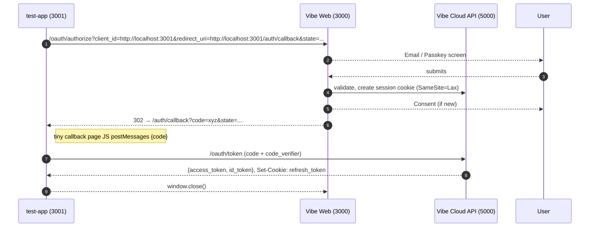
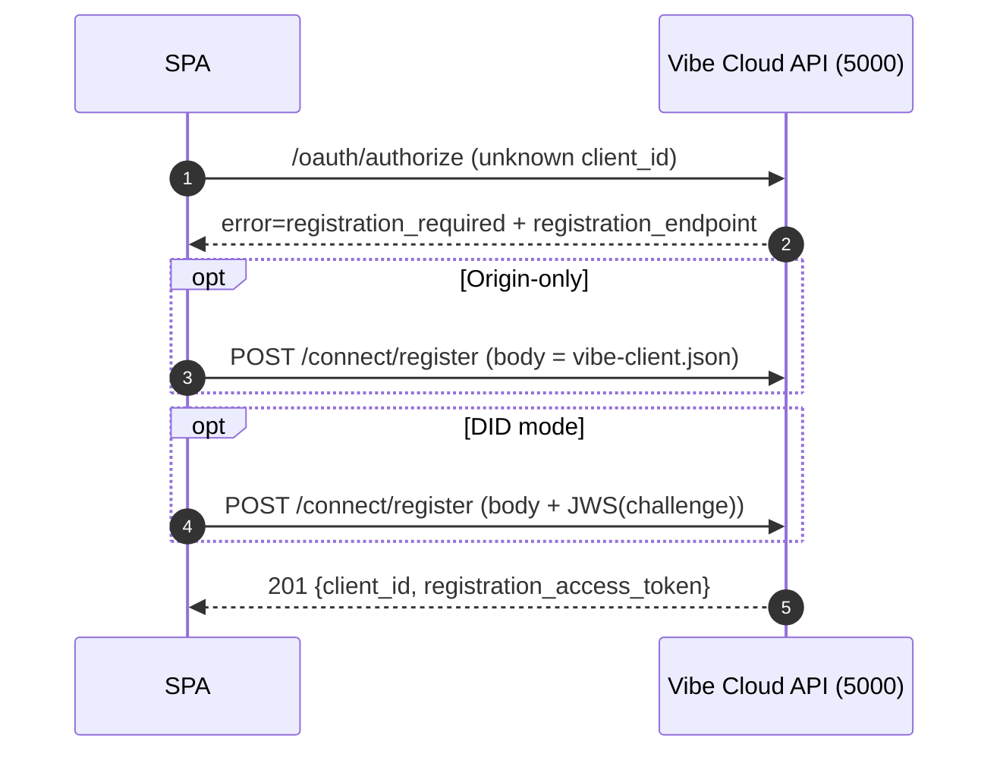

Below is a single, self-contained specification for the **Vibe Auth System** in local-development mode.

---

## 0 Quick glossary

| Abbr.              | Meaning                                                | Dev origin              |
| ------------------ | ------------------------------------------------------ | ----------------------- |
| **Vibe Web**       | Front-end for log-in, sign-up, consent, one-tap iframe | `http://localhost:3000` |
| **Vibe Cloud API** | Token minting, refresh rotation, client/consent DB     | `http://localhost:5000` |
| **test-app**       | 3ʳᵈ-party SPA #1                                       | `http://localhost:3001` |
| **test-app2**      | 3ʳᵈ-party SPA #2                                       | `http://localhost:3002` |
| **SDK**            | `@vibe/sdk` (core) + `@vibe/react` (UI hooks)          | bundled into every SPA  |

In prod localhost could be:

```
https://auth.vibe.com      (Vibe Web + Cloud API)
https://photos.example     (test-app)
https://chat.example       (test-app2)
```

---

## 1 Endpoints (OAuth 2.1 + OIDC + Dynamic Registration)

| Route                               | Method | Purpose                                                          |
| ----------------------------------- | ------ | ---------------------------------------------------------------- |
| `/.well-known/openid-configuration` | GET    | Discovery JSON (`issuer`, `authorization_endpoint`, …).          |
| `/.well-known/jwks.json`            | GET    | JWK set (public signing keys).                                   |
| `/oauth/authorize`                  | GET    | Auth-Z Code + PKCE entry-point **(popup)**.                      |
| `/oauth/token`                      | POST   | Code→Token, Refresh→Token, RT rotation.                          |
| `/oauth/revoke`                     | POST   | Revoke access or refresh token.                                  |
| `/oauth/userinfo`                   | GET    | Profile claims (optional for pure SPA).                          |
| `/session/check`                    | GET    | Used by hidden iframe & FedCM; `200` + profile preview or `204`. |
| `/session/logout`                   | POST   | Clears IdP session cookie, revokes all RTs.                      |
| `/connect/register`                 | POST   | RFC 7591 Dynamic Client Registration (JSON + proof).             |

| Category → resides at    | `http://localhost:3000`<br>**Vibe Web** (UI/session)                                                                                                                       | `http://localhost:5000`<br>**Vibe Cloud API** (tokens/DB)                                                                                                  |
| ------------------------ | -------------------------------------------------------------------------------------------------------------------------------------------------------------------------- | ---------------------------------------------------------------------------------------------------------------------------------------------------------- |
| **Discovery & keys**     | `/.well-known/openid-configuration` – returns JSON whose `token_endpoint` etc. point to `:5000`                                                                            | `/.well-known/jwks.json` – current public signing keys                                                                                                     |
| **OAuth & OIDC core**    | `/oauth/authorize` `GET` – popup start, PKCE<br>`/session/check` `GET` – hidden iframe & FedCM probe<br>`/session/logout` `POST` – clear IdP cookie, cascade RT revocation | `/oauth/token` `POST` – code→token, refresh→token, RT rotation<br>`/oauth/revoke` `POST` – revoke AT or RT<br>`/oauth/userinfo` `GET` – profile (optional) |
| **Dynamic registration** | —                                                                                                                                                                          | `/connect/register` `POST` – RFC 7591 JSON (+ DID/manifest proof)                                                                                          |

---

## 2 Client-identity flavours

```
client_id = one of
  A) Origin-only             e.g. "http://localhost:3001"
  B) DID mode (optional)     e.g. "did:vibe:123456#vibe-photos"
```

### 2.1 Origin-only (zero backend)

-   App hosts `/ .well-known/vibe-client.json`, e.g.:

```jsonc
{
    "redirect_uris": ["http://localhost:3001/auth/callback"],
    "scopes": ["read_photos"],
    "logo_uri": "/logo.svg"
}
```

### 2.2 ownerDid + appId (multi-origin / portable)

-   `client_id = ownerDid#appId`
-   DID Document lists:

```jsonc
{
    "id": "did:vibe:123456",
    "service": [
        {
            "id": "#vibe-client-photos",
            "type": "VibeClient",
            "serviceEndpoint": {
                "origins": ["https://photos.example", "https://cdn.jsdelivr.net/gh/alice/photos-app"],
                "jwks_uri": "https://photos.example/jwks.json"
            }
        }
    ]
}
```

-   Registration request is JWS-signed with one of those keys.

---

## 3 Popup + `postMessage` flow (first login on **test-app**)



• **Access token** = JWT, 15 min, `aud` = resource server
• **ID token** = JWT, 5 min, `aud` = `client_id`, contains `sub email name picture nonce`
• **Refresh token** = rotating, HttpOnly cookie, 90 days.

---

## 4 One-Tap discovery

| Path          | Browser support | Details                                                                                                                       |
| ------------- | --------------- | ----------------------------------------------------------------------------------------------------------------------------- |
| Hidden iframe | All             | `<iframe hidden src="http://localhost:3000/one-tap/frame">`; frame calls `/session/check`; returns preview via `postMessage`. |
| FedCM         | Chromium 121+   | `navigator.credentials.get({identity:{providers:[...]}})`; the browser replaces the iframe and cookie with a mediated prompt. |

SDK tries `window.FederatedCredentialManagement` first, else iframe.

---

## 5 Token refresh (silent)

1. `setTimeout` for _exp − 60 s_.
2. `fetch('http://localhost:3000/oauth/token', {grant_type:'refresh_token', credentials:'include'})`.
3. API rotates RT; sets `Set-Cookie: refresh_token=RT-n+1`.

---

## 6 Dynamic registration sequence (first contact)



IdP caches registration metadata (`client_id`, origins, jwks, scopes).

---

## 7 Consent & permission table

```
CREATE TABLE consents (
  user_id TEXT,
  client_id TEXT,
  scopes TEXT[],          -- array
  updated_at TIMESTAMP,
  PRIMARY KEY (user_id, client_id)
);
```

_When `client_id` is a DID, moving the app to a new origin **does not** change this primary key → users keep their consent._

---

### 7.1 Scopes and roles / user-groups

| Layer                            | Purpose                                           | How Vibe expresses it                                                                                                                                        |
| -------------------------------- | ------------------------------------------------- | ------------------------------------------------------------------------------------------------------------------------------------------------------------ |
| **OAuth scope** (coarse)         | Grants an _ability_ to the client application.    | Examples: `posts.read`, `posts.write`, `profile.basic` – shown on the consent screen.                                                                        |
| **Role / visibility tag** (fine) | Narrows what subset of data the token may touch.  | Custom JWT claim `role_set`, e.g. `["public","friends"]`.                                                                                                    |
| **Incremental trust**            | Let users expand access later without new scopes. | OAuth **RAR** (Rich Authorization Requests): the client re-runs `/oauth/authorize` with `request` JWT asking for extra roles; IdP shows a “step-up” consent. |
| **API enforcement**              | Decides row-level visibility at request time.     | Example rule: allow `GET /posts/{id}` only if `post.visibility ∈ token.role_set ∨ post.owner = token.sub`.                                                   |

Why this blend?

Scopes stay few and human-readable – no explosion like posts.read.public, posts.read.friends, ...

Roles live inside the access token, so the back-end can enforce them without another round-trip to the IdP.

## 8 Security controls

| Area            | Setting (local dev)                                                                      |
| --------------- | ---------------------------------------------------------------------------------------- |
| Session cookie  | `Name=vibe_session; Secure=false; HttpOnly; SameSite=Lax; Path=/; Domain=localhost`      |
| Refresh cookie  | `Name=refresh_token; Secure=false; HttpOnly; SameSite=Strict`                            |
| CSP on Vibe Web | `default-src 'self'; frame-ancestors 'self' http://localhost:3001 http://localhost:3002` |
| PKCE            | Always `S256`; reject plain.                                                             |
| State / Nonce   | 128-bit random, tied to sessionStorage per popup.                                        |
| RT rotation     | Detect reuse → revoke whole family.                                                      |
| CORS            | `/oauth/token`, `/connect/register` allow `Origin:{test-app}`, `credentials:true`.       |

---

## 9 SDK bootstrap snippet (React)

```jsx
import { VibeProvider, VibeOneTap, useVibe } from "vibe-react";

export default function App() {
    return (
        <VibeProvider
            clientId={window.location.origin} // origin-only mode
            redirectUri={`${window.location.origin}/auth/callback`}
            scopes={["read_photos"]}
            issuer="http://localhost:3000"
            oneTap
        >
            <LoginArea />
            {/* <VibeOneTap /> chip UI can manually be added if oneTap flag isn't set which adds the component automatically */}
        </VibeProvider>
    );
}

function LoginArea() {
    const { profile, login, ready } = useVibe();
    if (!ready) return null;
    if (profile) return <span>Hello {profile.name}</span>;
    return <button onClick={login}>Sign in with Vibe</button>;
}
```

# Vibe Auth – End‑to‑End Storyboard (local‑dev)

**Persona:** Patrik (end‑user)  **Browser:** Chrome 126  **Date:** 2025‑07‑06 
**Local services:**

-   Vibe Web (UI/session) – `http://localhost:3000`
-   Vibe Cloud API – `http://localhost:5000`
-   test‑app (Site A) – `http://localhost:3001`
-   test‑app2 (Site B) – `http://localhost:3002`

---

## 1  Patrik lands on Site A for the very first time

|  Visible to Patrik                                           |  Browser / Front‑end action                                                                                                                                                                                                                                                                                 |  Network & token activity                                                                                                          |
| ------------------------------------------------------------ | ----------------------------------------------------------------------------------------------------------------------------------------------------------------------------------------------------------------------------------------------------------------------------------------------------------- | ---------------------------------------------------------------------------------------------------------------------------------- |
| Homepage shows **“Sign in with Vibe”** button (no chip yet). | `@vibe/sdk` boots, injects hidden `<iframe src="http://localhost:3000/one‑tap/frame" hidden>`.                                                                                                                                                                                                              | `iframe → /session/check` (no `vibe_session` cookie) ⇒ **204 No Content**.                                                         |
| Clicks button.                                               | `sdk.login()` opens popup:<br>`http://localhost:3000/oauth/authorize?client_id=http://localhost:3001&redirect_uri=http://localhost:3001/auth/callback&state=…&code_challenge=…`                                                                                                                             | —                                                                                                                                  |
| Sees email/passkey form.                                     | —                                                                                                                                                                                                                                                                                                           | Vibe Web POSTs creds to Cloud API; API sets<br>`Set‑Cookie: vibe_session=SID…; HttpOnly; SameSite=Lax` (domain localhost, path /). |
| Sees consent “Let Photos read your posts”.                   | —                                                                                                                                                                                                                                                                                                           | On **Allow**, Cloud API issues **Authorization Code** (`exp = 5 min`) and 302 back to callback.                                    |
| Popup closes; page greets **“Hi Patrik”**.                   | Callback page JS grabs `code`, `state` → `postMessage` to opener → exchanges at `/oauth/token` (code + PKCE).<br>API returns:<br>• **access_token** (JWT, 15 min, aud = Photos API)<br>• **id_token** (JWT, 5 min, aud = client_id)<br>`Set‑Cookie: refresh_token=RT‑1; HttpOnly; SameSite=Strict; Path=/`. |                                                                                                                                    |

---

## 2  Hidden iframe upgrades to One‑Tap chip

| Visible                                               | Front‑end                                                                                                               | Network                            |
| ----------------------------------------------------- | ----------------------------------------------------------------------------------------------------------------------- | ---------------------------------- |
| A chip “Continue as Patrik” slides in (bottom‑right). | Iframe repeats `GET /session/check`; cookie present ⇒ **200** `{id_token_hint,name,picture}` → `postMessage` to parent. | No new cookies; just JSON payload. |
| Chip is a preview – no tokens sent yet.               | Parent SDK caches `nonce` for correlation.                                                                              | —                                  |

---

## 3  Silent refresh (T – 60 s before AT expiry)

1. `setTimeout` fires in SPA.
2. `fetch('http://localhost:3000/oauth/token', { body: grant_type=refresh_token, credentials:'include' })` automatically sends `refresh_token` cookie.
3. Cloud API verifies **RT‑1**, mints **RT‑2** + new AT/ID, rotates family, sets<br>   `Set‑Cookie: refresh_token=RT‑2 …`.
4. If a reused RT‑1 ever appears, API revokes the entire family.

---

## 4  Patrik opens Site B in another tab

| Visible                                        | Front‑end (Site B)                                                      | Network / security                                                                                              |
| ---------------------------------------------- | ----------------------------------------------------------------------- | --------------------------------------------------------------------------------------------------------------- |
| Site loads – One‑Tap chip appears immediately. | SDK injects iframe → `/session/check` → cookie valid → profile preview. | Same flow as §2.                                                                                                |
| Patrik clicks the chip.                        | `sdk.login()` popup:<br>`client_id=http://localhost:3002` (different!)  | Vibe Web sees session cookie → **skips credential screen**.<br>Shows consent for new scopes (e.g. `chat.read`). |
| Clicks **Allow**.                              | Popup receives code, exchanges via `/oauth/token`.                      | New RT family **RT‑1′** tied to `client_id=http://localhost:3002`.                                              |
| Site B greets “Hi Patrik”.                     | Tokens kept in memory; RT in Strict cookie.                             | —                                                                                                               |

---

## 5  User logs out on Site A

1. Photos SPA calls `sdk.logout()` → `POST /session/logout`.<br>2. Vibe Web deletes `vibe_session`; Cloud API revokes all RT families for that user session.<br>3. SDK writes `localStorage.setItem('vibe_logout', now)`; storage event broadcasts to all tabs.<br>4. Both SPAs purge in‑memory tokens; chips disappear; buttons revert to “Sign in with Vibe”.

---

## 6  Token & cookie summary (per origin)

| Secret          | Stored                          | Visibility          | Lifetime                                     |
| --------------- | ------------------------------- | ------------------- | -------------------------------------------- |
| `vibe_session`  | Cookie `3000`, Lax, HttpOnly    | IdP only            | Until `/session/logout` or 30 d idle timeout |
| `access_token`  | JavaScript memory in SPA        | Same tab only       | 15 min                                       |
| `id_token`      | Memory                          | Same tab only       | 5 min                                        |
| `refresh_token` | Cookie `3000`, Strict, HttpOnly | IdP only (never JS) | 90 d, rotating                               |

---

## 7  Security checkpoints

-   **SameSite=Lax** on session cookie prevents CSRF login CSRF.
-   **PKCE S256**, `state`, `nonce` mitigate code‑swap and replay.
-   Each `client_id` (A vs. B) gets its **own** refresh‑token family and row in the consent table.
-   One‑Tap iframe sends **profile preview only** – no AT/RT can cross origins.
-   CSP on Vibe Web: `frame-ancestors 'self' http://localhost:3001 http://localhost:3002` blocks click‑jacking.

---

### End of storyboard
