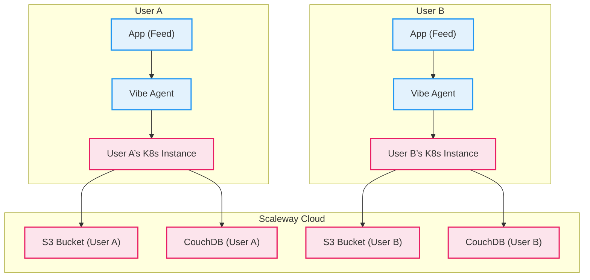

# Vibe Cloud: Current Architecture (As-Is)

This document provides a detailed overview of the current Vibe Cloud architecture. It serves as a baseline for understanding the existing system before brainstorming and designing the new multi-tenant model.

## 1. Overall Architecture: Single-Tenant Model

The fundamental principle of the current architecture is **single-tenancy**. Each user is provisioned with their own completely isolated Vibe Cloud backend instance. This provides maximum security and data isolation but comes at a higher operational cost and complexity for user onboarding.

## 2. Identity & Self-Sovereign Identity (SSI)

The current model is built entirely on the concept of Self-Sovereign Identity.

-   **Vibe Agent is Mandatory**: The `Vibe Agent` (browser extension) is a required component for every user. It is the sole custodian of the user's identity.
-   **Mnemonic-Based Keys**: Upon first use, the user creates their identity by generating a 12 or 24-word mnemonic phrase. This phrase is the master key for their entire digital identity within the Vibe ecosystem.
-   **No Central Identity Provider**: There is no central server for user accounts or passwords. Authentication is achieved by the Vibe Agent signing challenges presented by applications, proving ownership of the private key derived from the mnemonic.

## 3. User Provisioning

Onboarding a new user is a manual or semi-automated process executed via a shell script.

-   **`provision.sh` Script**: This script is the entry point for creating a user's infrastructure.
-   **Scaleway Resources**: The script uses the `scw` CLI to:
    1.  Create a dedicated S3 bucket for the user's blob storage.
    2.  Create a specific IAM policy that grants access only to that bucket.
    3.  Generate IAM credentials (access key/secret key) for the user's backend instance.
-   **Kubernetes Deployment**: The script then uses `helm` to deploy a new instance of the `vibe-cloud-api` into the shared Kubernetes cluster, injecting the user-specific IAM credentials and other configurations.

## 4. Permission Model (v1)

The permission system is application-centric and based on collections.

-   **Collection-Based Permissions**: Permissions are granted on a per-app, per-collection basis. For example, an app's manifest might request `blob:read:profile` or `data:write:posts`.
-   **User Consent**: When a user connects an app, the Vibe Agent presents these requested permissions for approval.
-   **Backend Enforcement**: The `vibe-cloud-api` backend does not currently have a robust mechanism for enforcing these permissions, as it is assumed that only the user's own apps (authorized via the agent) can access it. The security is based on network and infrastructure isolation, not granular API-level checks.

## 5. Blob Storage Implementation

The blob storage implementation leverages presigned URLs for security and efficiency.

-   **Dedicated S3 Buckets**: As mentioned, each user has their own S3 bucket.
-   **Presigned URLs**: The flow for file uploads is as follows:
    1.  The client-side app (via `vibe-sdk`) requests an upload URL from the user's `vibe-cloud-api` instance.
    2.  The backend, using its dedicated IAM credentials, generates a short-lived, presigned S3 PUT URL.
    3.  The client uploads the file directly to the specified URL in the user's S3 bucket.
    4.  The client then calls a `/finalize-upload` endpoint to create the associated metadata document in the user's CouchDB.

This approach avoids proxying large files through the API server and ensures the backend is only responsible for authorization, not data transfer.
