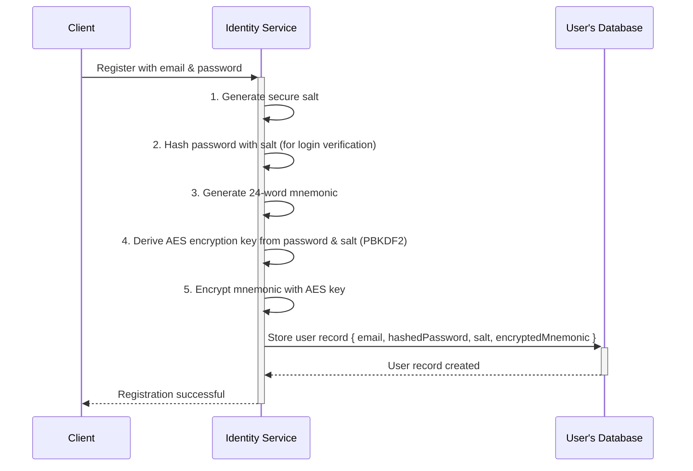

# Vibe Cloud: Multi-Tenant Architecture v2

This document outlines the proposed architecture for the next generation of Vibe Cloud, transitioning from a single-tenant, user-deployed model to a centralized, multi-tenant Software-as-a-Service (SaaS) platform.

## 1. Core Principles

-   **Multi-Tenancy**: A single, shared infrastructure will serve all users, providing significant cost and operational efficiency.
-   **Simplified Onboarding**: Users can sign up with a simple email and password, lowering the barrier to entry.
-   **Hosted & Self-Sovereign Identity**: The platform will manage user identities and keys by default ("hosted"), while still allowing advanced users to maintain full self-sovereignty via the Vibe Agent.
-   **User-Centric Permissions**: The permission model will be based on the concepts of User Groups and App Trust Levels, as defined in `FuturePermissionModel.md`.

## 2. High-Level Architecture Diagram

This diagram illustrates the main components of the proposed multi-tenant architecture.

```mermaid
graph TD
    subgraph User's Device
        A[Client App e.g., Feed]
        B[Vibe Agent (Optional)]
    end

    subgraph Vibe Cloud (Multi-Tenant SaaS)
        C[API Gateway]
        D[Identity Service]
        E[Data & Permissions API]
        F[Groups Service]
        G[Shared Database Cluster e.g., CouchDB/Postgres]
        H[Shared Blob Storage e.g., Scaleway S3]
    end

    A -- HTTPS Request --> C
    B -- HTTPS Request --> C

    C -- Authenticates via JWT --> D
    C -- Routes to --> E
    C -- Routes to --> F

    D -- Manages Users, Keys --> G
    E -- Manages User Data, ACLs --> G
    E -- Manages Blobs --> H
    F -- Manages Group Info --> G

    E -- Checks Permissions --> F

    linkStyle 0 stroke:#6a0dad,stroke-width:2px;
    linkStyle 1 stroke:#6a0dad,stroke-width:2px;
    linkStyle 2 stroke:#ff69b4,stroke-width:2px,stroke-dasharray: 5 5;
    linkStyle 3 stroke:#00bcd4,stroke-width:2px;
    linkStyle 4 stroke:#00bcd4,stroke-width:2px;
    linkStyle 5 stroke:#4caf50,stroke-width:2px;
    linkStyle 6 stroke:#4caf50,stroke-width:2px;
    linkStyle 7 stroke:#4caf50,stroke-width:2px;
    linkStyle 8 stroke:#ff9800,stroke-width:2px,stroke-dasharray: 3 3;

    classDef default fill:#f9f9f9,stroke:#333,stroke-width:2px;
    classDef userDevice fill:#e3f2fd,stroke:#2196f3,stroke-width:2px;
    classDef vibeCloud fill:#fce4ec,stroke:#e91e63,stroke-width:2px;

    class A,B userDevice;
    class C,D,E,F,G,H vibeCloud;
```

## 3. Core Components

### 3.1. Identity Service

-   **Responsibilities**:
    -   User registration (email + password).
    -   User login and session management (issuing JWTs).
    -   Securely storing user profiles and cryptographic keys. For hosted users, keys will be encrypted with a secret derived from their password.
-   **Technology**: A standalone service. Could be built with ElysiaJS.

### 3.2. API Gateway

-   **Responsibilities**:
    -   Acts as the single entry point for all client requests.
    -   Validates the JWT from the `Authorization` header with the Identity Service.
    -   Routes requests to the appropriate downstream service (e.g., Data API, Groups Service).
-   **Technology**: Can be implemented using a dedicated gateway solution (like Traefik, NGINX) or as part of the main application framework.

### 3.3. Data & Permissions API

-   **Responsibilities**:
    -   Handles all CRUD operations for user data (documents, collections).
    -   Enforces the v2 permission model by checking the `acl` on resources against the requesting app's trust level and the user's identity.
    -   Manages blob storage, creating presigned URLs for uploads/downloads within the shared S3 bucket, using user-specific prefixes for data isolation (e.g., `s3://vibe-bucket/user-123/profile.jpg`).
-   **Evolution**: This is the multi-tenant evolution of the current `vibe-cloud-api`.

### 3.4. Groups Service

-   **Responsibilities**:
    -   Manages the creation, deletion, and membership of user groups.
    -   Provides an internal API for the Data & Permissions API to resolve group memberships during permission checks.
-   **Technology**: A new microservice, likely built with ElysiaJS.

## 4. Data Tenancy Model

A critical decision in a multi-tenant system is how to isolate tenant (user) data. Based on the existing use of CouchDB and the core principle of user data control, we will adopt the **One Database Per User** model.

-   **Implementation**: When a new user registers, the `Identity Service` will be responsible for provisioning a new, dedicated database for that user within the shared CouchDB cluster (e.g., `user-db-f4a7b`). All data for that user, including documents, groups, and ACLs, will be stored in this database.

-   **Rationale**:

    -   **Strong Security & Isolation**: This is the primary advantage. It provides the strongest possible separation between user data at the database level. A bug in application code is far less likely to cause a cross-tenant data leak.
    -   **Simplified Queries**: Application logic becomes simpler as it doesn't need to add a `userId` filter to every database query.
    -   **Alignment with CouchDB Features**: This model allows us to leverage CouchDB's per-database permissions, which can be used as an additional layer of security.
    -   **Per-Tenant Operations**: It simplifies user-specific operations like backup, restore, or data migration.

-   **Considerations**:
    -   **Scalability**: CouchDB can face performance degradation when managing tens of thousands of databases (the "many-database problem"). This is a long-term concern that can be addressed with clustering, sharding, or migrating to a different database system (like Postgres with a schema-per-tenant model) if the platform reaches that scale. For the initial implementation, the security benefits outweigh this risk.

## 5. Key Management & Hosted Identities

This section details the flow for managing user keys in the hosted model, ensuring that the user's password is the only key to their identity. The server never stores the password or the unencrypted master key.

### 5.1. User Registration Flow



1.  **Client**: The user provides their email and password.
2.  **Identity Service**:
    -   Generates a unique, random salt for the user.
    -   Hashes the password with the salt (e.g., using Argon2 or scrypt) to create a `hashedPassword` for login checks.
    -   Generates a new BIP39 mnemonic phrase (the user's master key).
    -   Derives a strong AES-256 encryption key from the user's original password and the salt using PBKDF2.
    -   Encrypts the mnemonic phrase using this AES key.
    -   Stores the `email`, `hashedPassword`, `salt`, and `encryptedMnemonic` in the user's record.
    -   **Crucially, the plaintext password and the unencrypted mnemonic are immediately discarded from memory.**

### 5.2. User Login & Session Flow

```mermaid
sequenceDiagram
    participant Client
    participant IdentityService as Identity Service
    participant UserDB as User's Database

    Client->>+IdentityService: Login with email & password
    IdentityService->>+UserDB: Fetch user record { hashedPassword, salt, encryptedMnemonic }
    UserDB-->>-IdentityService: Return user record
    IdentityService->>IdentityService: 1. Verify password against hashedPassword
    alt Password is Correct
        IdentityService->>IdentityService: 2. Derive AES key from password & salt (PBKDF2)
        IdentityService->>IdentityService: 3. Decrypt encryptedMnemonic with AES key
        IdentityService->>IdentityService: 4. Generate JWT containing the decrypted mnemonic
        Note right of IdentityService: The mnemonic lives ONLY in the JWT payload, not on the server.
        IdentityService-->>-Client: Return JWT
    else Password is Incorrect
        IdentityService-->>-Client: Return "Unauthorized" error
    end
```

1.  **Client**: The user logs in with their email and password.
2.  **Identity Service**:
    -   Retrieves the user's record from the database.
    -   Verifies the provided password against the stored `hashedPassword`.
    -   If valid, it re-derives the same AES encryption key using the provided password and the stored `salt`.
    -   It uses this key to decrypt the `encryptedMnemonic`.
    -   It then creates a short-lived JSON Web Token (JWT). The **decrypted mnemonic is placed inside the JWT payload**.
    -   The service sends this JWT back to the client. The decrypted mnemonic is then wiped from the service's memory.

### 5.3. API Interaction

-   When the client makes a request to another service (e.g., the Data API), it includes the JWT in the `Authorization` header.
-   The receiving service validates the JWT and extracts the mnemonic from its payload.
-   It can then use the mnemonic to derive the necessary private keys on-the-fly to perform actions on behalf of the user (e.g., signing a transaction or decrypting a piece of data).
-   This architecture ensures that the user's master key is only ever held in memory by the service processing the request, and only for the duration of that request.

## 6. Next Steps & Open Questions

With the core architectural decisions made, the next steps involve defining the implementation details:

1.  **API Specification**: Define the specific endpoints, request/response schemas, and JWT structure for the new services.
2.  **Infrastructure Provisioning**: Detail the Terraform and Kubernetes configurations for deploying the shared infrastructure.
3.  **Client-Side SDK (`vibe-sdk`) Changes**: How will the SDK be updated to handle the new authentication flow (email/password login) and manage the JWT?

This document will be updated as we flesh out these details.
