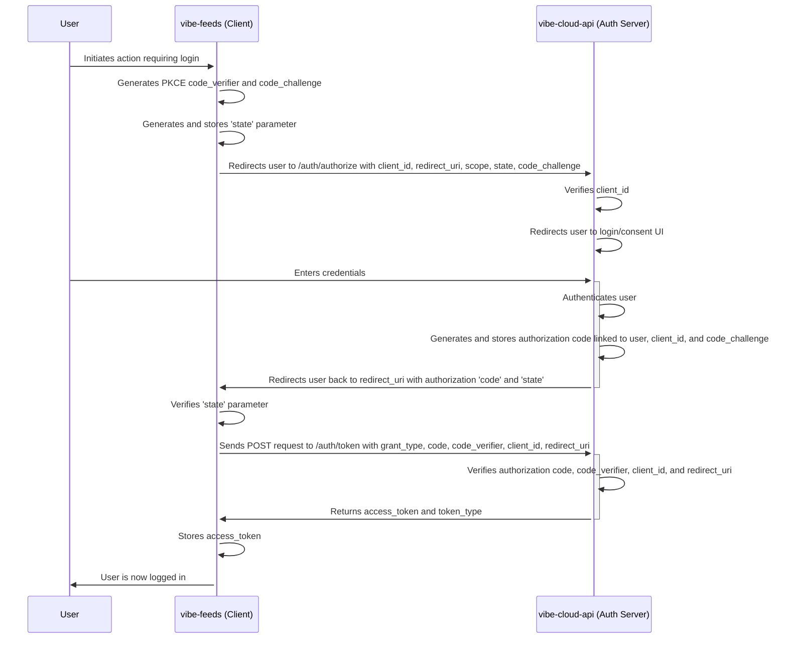

# Vibe Authentication Flow Analysis

## Authorization Code Flow with PKCE

The following diagram illustrates the "default" authentication flow, which is intended to follow the Authorization Code Flow with PKCE standard.

## Analysis

Based on my review of the code and the diagram, the current implementation appears to correctly follow the Authorization Code Flow with PKCE. The key steps are all present:

-   **PKCE:** The client generates a `code_verifier` and `code_challenge`, which are used to secure the token exchange.
-   **State:** The `state` parameter is used to prevent Cross-Site Request Forgery (CSRF) attacks.
-   **Token Exchange:** The client exchanges the authorization code for an access token by making a POST request to the `/auth/token` endpoint.

However, the persistent "400 Bad Request" and CORS errors indicate a fundamental problem in the implementation of the `/auth/token` endpoint on the `vibe-cloud-api` server. My previous attempts to fix this by adjusting the CORS headers and error handling have failed, which suggests that the issue lies deeper.

I will now re-examine the code with this diagram in mind to identify the root cause of the problem.
