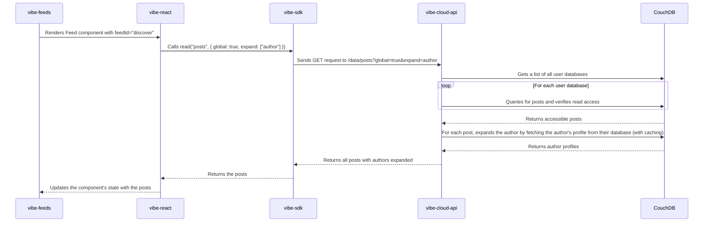

# Feeds App Architecture

This document provides a detailed description of the current architecture of the Feeds app, with a focus on the communication flow between its components in both standalone and hub modes.

## Components

The Feeds app is composed of several key components that work together to provide a decentralized feed experience:

-   **`vibe-feeds`**: The main frontend application, built with Next.js and React. It provides the user interface for viewing and interacting with feeds.
-   **`vibe-react`**: A React library that provides the `VibeProvider` and `useVibe` hook, which simplify the integration of Vibe functionality into React applications.
-   **`vibe-sdk`**: A TypeScript library that handles the communication with the `vibe-cloud-api`. It provides methods for reading and writing data, as well as handling authentication and session management.
-   **`vibe-cloud-api`**: The backend service that acts as a secure orchestrator and gatekeeper for the user's data. It handles requests from the `vibe-sdk` and interacts with the user's CouchDB database.
-   **`CouchDB`**: A NoSQL database that stores the user's data. Each user has their own dedicated CouchDB database, ensuring data isolation and user control.

## Standalone Mode

The `vibe-feeds` application currently operates in **Standalone Mode**. In this mode, all communication between the application and the user's data goes through the `vibe-cloud-api`.

### "Discover" Feed Communication Flow

The "Discover" feed is a global, aggregated feed that includes posts from all users in the system. The following diagram illustrates the communication flow for fetching the "Discover" feed:

### Hub Mode (Experimental)

The **Hub Mode** is an experimental feature that is not yet fully implemented in the `vibe-feeds` application. In this mode, the `vibe-sdk` loads a sandboxed `hub.html` iframe into the application, which acts as a local data proxy. The Hub maintains a local PouchDB instance that performs a live, real-time sync with the user's personal CouchDB database. This allows for near-instantaneous reads and real-time data updates.

While the `vibe-feeds` application is not currently configured to use Hub Mode (the `useHub` flag in the `appManifest` is set to `false`), the underlying `vibe-sdk` and `vibe-cloud-api` have the necessary logic to support it.

## Summary

The current implementation of the "Discover" feed in the `vibe-feeds` application relies on a simple but potentially inefficient approach of querying every user's database to construct the aggregated feed. While this approach works for a small number of users, it does not scale well and can lead to performance issues as the number of users grows.

The `ARCHITECTURE.md` document outlines several areas for research and development to address these limitations, including decentralized indexing, peer-to-peer content discovery, and query aggregation. These improvements will be crucial for evolving Vibe into a platform for truly decentralized, collaborative applications.
