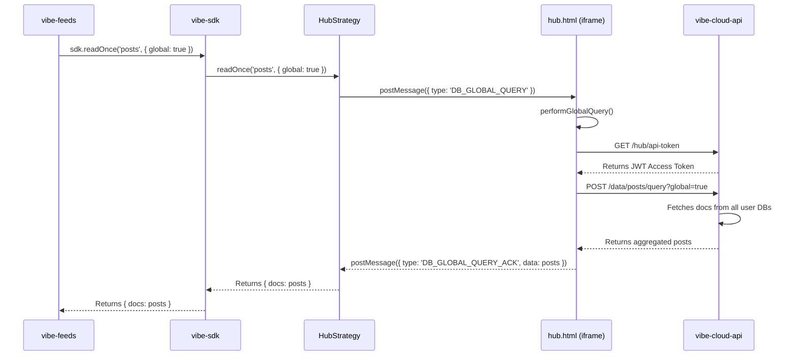
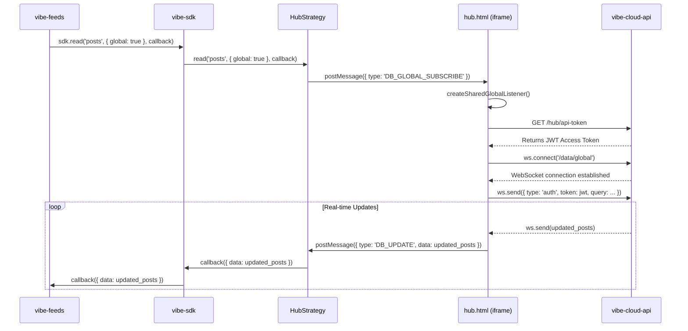
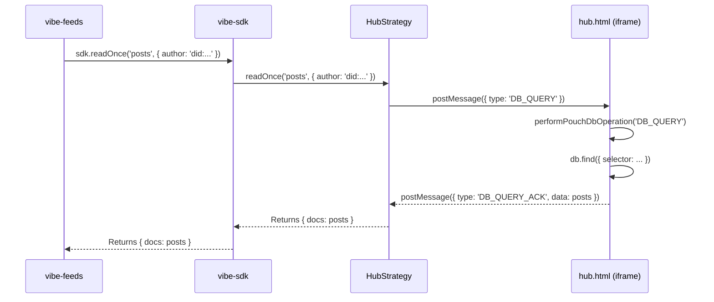
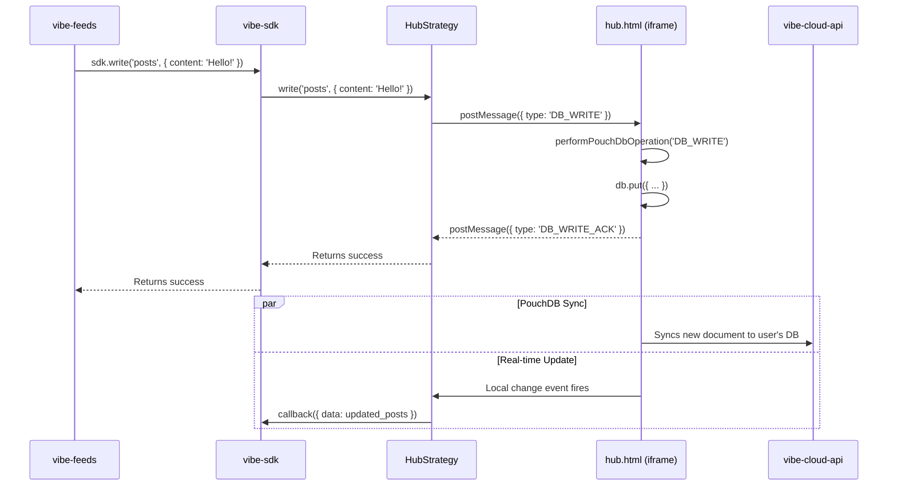

# Vibe SDK: Hub Mode Technical Deep Dive

This document provides a detailed technical explanation of the Vibe SDK's "Hub Mode." It outlines the architecture, data flow, and core concepts behind its functionality, focusing on how data is aggregated, read, and written.

## 1. Core Components

The Hub Mode architecture is composed of several key components that work together to provide a semi-decentralized experience with local caching capabilities.

-   **`vibe-feeds` (or any Vibe App)**: The client-side application that consumes the Vibe SDK. It is unaware of the underlying complexity and interacts with a simple, unified SDK interface.
-   **`vibe-sdk`**: The primary interface for the application. It exposes methods like `read`, `readOnce`, and `write`. Internally, it delegates these calls to a selected strategy. In Hub Mode, it uses two strategies:
    -   **`StandaloneStrategy`**: Handles all authentication flows (login, logout, session management).
    -   **`HubStrategy`**: Handles all data operations (`read`, `write`, etc.) by communicating with `hub.html`.
-   **`hub.html`**: A hidden iframe, loaded from the `vibe-cloud-api` domain, that acts as a secure, sandboxed data hub. It maintains a persistent PouchDB database, manages WebSocket connections, and orchestrates data access between the app and the cloud API.
-   **`vibe-cloud-api`**: The backend service. It provides API endpoints for authentication, data storage, and real-time communication.

## 2. Data Flow Analysis

This section breaks down the sequence of events for various operations.

### Scenario 1: Global `readOnce`

This is the flow used by `vibe-feeds` to fetch the main feed, aggregating posts from all users.

**Step-by-Step Breakdown:**

1.  **App to SDK**: The `vibe-feeds` application calls `sdk.readOnce('posts', { global: true, expand: ['author'] })`.
2.  **SDK to Strategy**: The `VibeSDK` instance, configured for Hub Mode, delegates this call to the `HubStrategy`.
3.  **Strategy to Hub**: The `HubStrategy` sends a `postMessage` to the `hub.html` iframe with the type `DB_GLOBAL_QUERY`. It generates a unique `nonce` to track the request.
4.  **Hub Receives Message**: `hub.html`'s message listener receives the event and calls its internal `performGlobalQuery` function.
5.  **Hub Auth**: The hub first calls the `/hub/api-token` endpoint on the `vibe-cloud-api` to get a short-lived JWT access token. This is necessary to authenticate the subsequent data request.
6.  **Hub to API**: The hub then makes a `POST` request to the `/data/posts/query?global=true` endpoint on the API, including the access token in the `Authorization` header. The body of the request contains the query selector.
7.  **API Aggregation**: The API's `/data/:collection/query` handler detects the `global=true` parameter. It then iterates through all user databases, executes the query against each one, and aggregates the results into a single array of documents.
8.  **API to Hub**: The API responds to the hub with the aggregated list of post documents.
9.  **Hub to Strategy**: `hub.html` receives the response. It then sends a `postMessage` back to the `HubStrategy` with the type `DB_GLOBAL_QUERY_ACK`, the original `nonce`, and the array of posts as the `data`.
10. **Strategy to SDK**: The `HubStrategy`'s message handler finds the pending request matching the `nonce`. It resolves the promise, returning the data to the `VibeSDK`.
11. **SDK to App**: The `VibeSDK` returns the final, structured response (`{ docs: [...] }`) to the `vibe-feeds` application, which can then render the posts.

### Scenario 2: Global `read` (Real-time Subscription)

This flow is similar to `readOnce` but establishes a persistent WebSocket connection for real-time updates.

**Step-by-Step Breakdown:**

1.  **Subscription Request**: The app calls `sdk.read` with a callback function. The `HubStrategy` sends a `DB_GLOBAL_SUBSCRIBE` message to the hub.
2.  **WebSocket Connection**: The hub creates a WebSocket connection to the `/data/global` endpoint on the `vibe-cloud-api`.
3.  **Authentication**: Once connected, the hub authenticates the WebSocket by sending the JWT access token.
4.  **Initial Data**: The API immediately sends down the initial set of aggregated posts.
5.  **Live Updates**: The API's global changes feed listens for changes in any user database. When a relevant change occurs (e.g., a new post is created), the API pushes the updated, aggregated list of posts down the WebSocket to the hub.
6.  **Hub to App**: The hub receives the update and forwards it to the `HubStrategy`, which in turn invokes the application's callback function with the new data.

### Scenario 3: Standard `readOnce` and `read` (Non-Global)

When the `global: true` flag is omitted, the operation targets the user's own data, which is cached locally in the hub's PouchDB instance.

**Key Differences:**

-   **No API Calls**: All data is read directly from the local PouchDB instance within the `hub.html` iframe. This is significantly faster.
-   **PouchDB Sync**: The local data is kept up-to-date by a continuous, live PouchDB sync process that runs in the background between the hub and the user's personal database on the `vibe-cloud-api`.
-   **Real-time**: The `read` operation works similarly, but instead of a one-time query, it listens for changes on the local PouchDB instance and pushes updates to the app.

### Scenario 4: `write` Operation

All write operations (`write`, `remove`) are handled by the hub and synced to the cloud.

**Step-by-Step Breakdown:**

1.  **Write to Hub**: The `HubStrategy` sends a `DB_WRITE` message to the hub.
2.  **Local Write**: The hub writes the new document directly to its local PouchDB instance.
3.  **Acknowledgement**: The hub immediately acknowledges the write to the application, providing a fast, optimistic UI update.
4.  **Background Sync**: In the background, the PouchDB sync process automatically pushes the new document to the user's database on the `vibe-cloud-api`.

### Scenario 5: The `expand` Mechanism

The `expand` feature allows for embedding related documents (e.g., an author's profile within a post) directly into a query response.

-   **Local Expansion**: If the document to be expanded belongs to the current user, the hub fetches it directly from its local PouchDB.
-   **Remote Expansion**: If the document belongs to another user, the hub makes a specific API call to `/data/expand?did=...&ref=...`. The results of these remote lookups are cached in the hub's PouchDB to reduce redundant API calls.

### Scenario 6: Permissions and ACLs

Access control is enforced at two levels:

1.  **Hub Level**: Before performing any operation, `hub.html` checks a cached set of permissions. It fetches these permissions from the `/hub/permissions` endpoint on the API. This endpoint determines if the application (`client_id`) has been granted consent by the user to perform certain actions (e.g., `read`, `write`).
2.  **API Level**: The `vibe-cloud-api` performs its own validation on every request, ensuring that the authenticated user (from the JWT) is authorized to access the requested resources. For global queries, this involves checking access rights for each database being queried.
