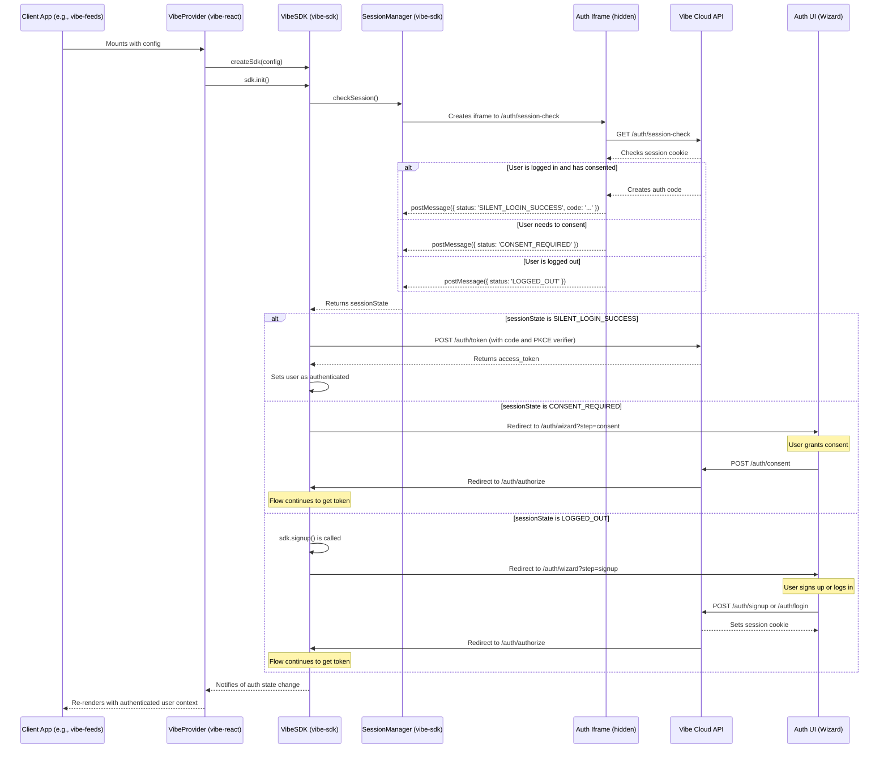

# Vibe Authentication Flow

This document outlines the authentication flow for Vibe applications, from the initial page load to a fully authenticated user session.

## Overview

The authentication process is based on OAuth 2.0 with PKCE (Proof Key for Code Exchange). It uses a combination of a client-side SDK (`vibe-sdk`), a React provider (`vibe-react`), and a backend API (`vibe-cloud-api`). The flow is designed to be secure and seamless for single-page applications.

A key component is the "Hub," an iframe-based communication channel that allows for secure cross-origin communication and a centralized session management mechanism.

## Sequence Diagram

## Detailed Flow

1.  **Initialization**:

    -   The React application (`vibe-feeds`) wraps its main component with the `VibeProvider` from `vibe-react`.
    -   `VibeProvider` initializes the `VibeSDK`, passing in the application manifest which contains configuration like `apiUrl`, `clientId`, and `redirectUri`.
    -   `VibeProvider` calls `sdk.init()`.

2.  **Session Check**:

    -   `VibeSDK.init()` calls `sessionManager.checkSession()`.
    -   The `SessionManager` creates a hidden iframe pointing to the `/auth/session-check` endpoint on the `vibe-cloud-api`. This request includes the `client_id` and a PKCE code challenge.
    -   The API checks for a `vibe_session` HTTP-only cookie.
    -   Based on the session's validity and the user's consent status for the given `client_id`, the API renders a script in the iframe that uses `postMessage` to send the session state back to the `SessionManager`. The possible states are:
        -   `SILENT_LOGIN_SUCCESS`: The user is logged in and has consented. The message includes a one-time authorization code.
        -   `CONSENT_REQUIRED`: The user is logged in but has not consented to this application.
        -   `LOGGED_OUT`: The user is not logged in.

3.  **Handling Session State**:

    -   **`SILENT_LOGIN_SUCCESS`**: The `VibeSDK` receives the authorization code. It then makes a POST request to the `/auth/token` endpoint on the API, exchanging the code and the PKCE code verifier for an access token. The user is now fully authenticated on the client side.
    -   **`CONSENT_REQUIRED`**: The `VibeSDK` redirects the user to the consent page of the authentication UI (`/auth/wizard?step=consent`). After the user gives consent, the flow is re-initiated via the `/auth/authorize` endpoint.
    -   **`LOGGED_OUT`**: The `VibeProvider` logic, by default, calls `sdk.signup()`. This redirects the user to the signup/login page of the authentication UI (`/auth/wizard?step=signup`).

4.  **User Interaction (Login/Signup/Consent)**:

    -   The user interacts with the UI hosted by the `vibe-cloud-api` (the "wizard").
    -   **Login**: The user submits their credentials to `/auth/login`. On success, the API sets the `vibe_session` cookie and redirects the browser to the `/auth/authorize` endpoint to continue the OAuth flow.
    -   **Signup**: The user registers via `/auth/signup`. On success, a session cookie is set, and the user is typically forwarded to the next step in the wizard (e.g., profile creation).
    -   **Consent**: The user approves the application via `/auth/consent`. The API records the consent and redirects to `/auth/authorize` to complete the flow.

5.  **Authorization Code Flow**:

    -   The `/auth/authorize` endpoint is the core of the OAuth flow. If it's determined that the user is authenticated and has consented, it generates an authorization code and redirects the user back to the application's configured `redirectUri`.
    -   The application's callback page (`/auth/callback`) receives the authorization code. It calls the `sdk.handleRedirectCallback()` method.
    -   The SDK then exchanges the code for an access token at the `/auth/token` endpoint, completing the authentication process.

6.  **Authentication State Management**:
    -   The `VibeSDK` uses an internal `AuthManager` to store the access token and user information.
    -   It exposes an `onStateChange` method that the `VibeProvider` subscribes to.
    -   When the authentication state changes (e.g., after a successful login or logout), the `VibeProvider` is notified and updates its state, causing the React application to re-render with the correct user context.

## Proposed Features & Improvements

Based on the analysis of the current authentication flow, here are some potential areas for improvement and new features:

### 1. Social Logins (OAuth/OIDC Federation)

-   **Description**: Allow users to sign up and log in using their existing accounts from popular providers like Google, GitHub, or Twitter.
-   **Benefits**:
    -   Reduces friction for new users, potentially increasing conversion rates.
    -   Users don't have to remember another password.
    -   Leverages the security of established identity providers.
-   **Implementation Sketch**:
    -   Integrate a library like `passport.js` or `elysia-auth` on the `vibe-cloud-api`.
    -   Add buttons for social providers on the signup/login UI.
    -   The backend would handle the OAuth/OIDC dance with the external provider.
    -   On successful authentication, create a local Vibe user account and link it to the external provider's ID.

### 2. Passwordless Authentication (Magic Links/WebAuthn)

-   **Description**: Implement passwordless login options.
    -   **Magic Links**: Users enter their email, and a one-time login link is sent to them.
    -   **WebAuthn**: Allow users to log in using biometrics (fingerprint, face ID) or hardware security keys (YubiKey).
-   **Benefits**:
    -   **Enhanced Security**: Eliminates password-related risks like phishing, credential stuffing, and weak passwords. WebAuthn is phishing-resistant.
    -   **Improved User Experience**: No passwords to create, remember, or reset.
-   **Implementation Sketch**:
    -   **Magic Links**:
        -   Create a new endpoint on the API to generate and email a single-use tokenized link.
        -   The user clicks the link, and the client exchanges the token for a session.
    -   **WebAuthn**:
        -   Use a library like `simplewebauthn` on both the client and server.
        -   The client-side code would interact with the browser's WebAuthn API.
        -   The server would handle the registration and authentication ceremonies (challenge/response).

### 3. Two-Factor Authentication (2FA)

-   **Description**: Add an extra layer of security by requiring a second factor of authentication, such as a code from an authenticator app (TOTP) or an SMS message.
-   **Benefits**:
    -   Significantly increases account security, even if a user's password is compromised.
-   **Implementation Sketch**:
    -   Integrate a library for TOTP (Time-based One-Time Password) generation and verification.
    -   Add a 2FA setup process in the user's profile settings.
    -   Modify the login flow to prompt for the 2FA code after password verification.

### 4. Granular Permissions & Scopes

-   **Description**: The current system seems to grant full access upon consent. The OAuth `scope` parameter could be used to implement more granular permissions. For example, an application could request `read:posts` and `write:comments` scopes.
-   **Benefits**:
    -   **Principle of Least Privilege**: Applications only get the permissions they absolutely need.
    -   **Increased User Trust**: Users can see exactly what an application is requesting to do.
-   **Implementation Sketch**:
    -   Define a set of available scopes in the `vibe-cloud-api`.
    -   Update the consent screen to display the requested scopes to the user.
    -   Store the granted scopes along with the user's consent.
    -   The API would then validate the access token's scopes before allowing access to a protected resource.

### 5. Refresh Tokens

-   **Description**: The current access tokens have a short lifespan (15 minutes). Implement refresh tokens to allow for longer-lived sessions without compromising security.
-   **Benefits**:
    -   **Improved User Experience**: Users are not forced to re-authenticate frequently.
    -   **Enhanced Security**: Access tokens can be short-lived, reducing the window of opportunity if one is compromised. Refresh tokens are stored more securely and can be revoked.
-   **Implementation Sketch**:
    -   When exchanging the authorization code, the `/auth/token` endpoint would return both an access token and a refresh token.
    -   The `VibeSDK` would securely store the refresh token.
    -   When the access token expires, the SDK would use the refresh token to silently request a new access token from the API.
