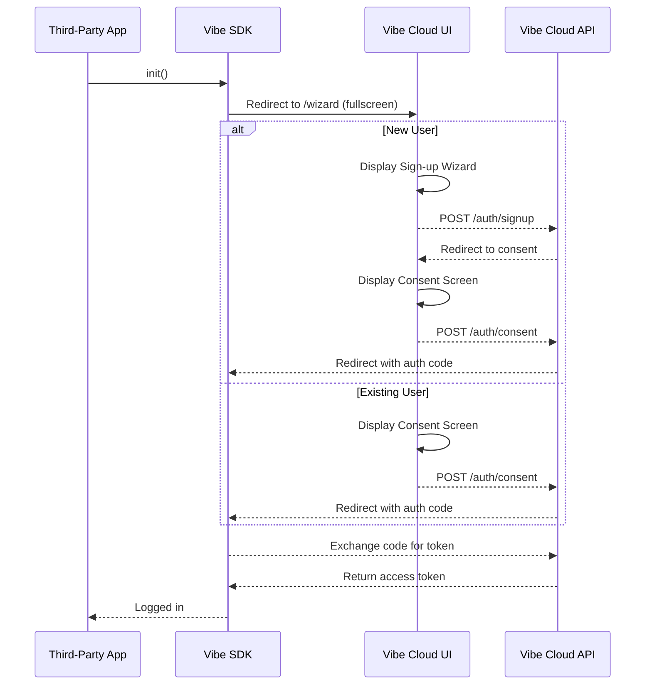

# Plan for New Authentication Flow

This document outlines the plan to revamp the authentication flow to create a more immersive, "full screen" sign-up and consent experience.

## 1. Implement the full-screen sign-up/consent flow

The goal is to create a seamless, full-screen experience for the user, where the sign-up or consent form is displayed immediately on the page without any additional clicks.

-   **Current State:** The `standalone` strategy in the SDK initiates the authentication flow, and the `vibe-cloud-ui` provides the UI. The `wizard/page.tsx` already implements a two-column layout, but it's not a true wizard yet.
-   **To-Do:**
    -   Modify the `standalone` strategy to launch the full-screen flow directly, instead of a popup.
    -   The initial view should be the sign-up form if the user is new, or the consent form if the user is already logged in.

## 2. Create a dedicated consent screen

A dedicated consent screen is needed to clearly communicate the permissions being requested by the application.

-   **Current State:** There is a `consent/page.tsx` file, but it's likely a placeholder. The current wizard combines login and signup, but doesn't have a distinct consent step.
-   **To-Do:**
    -   Implement a new consent page that displays the client application's name, logo, and the requested scopes.
    -   The page should have "Allow" and "Deny" buttons.
    -   The design should be consistent with the co-branded sign-up wizard.

## 3. Refine the sign-up wizard

The sign-up wizard needs to be refined to guide the user through the sign-up process step-by-step.

-   **Current State:** `wizard/page.tsx` has a two-column layout but presents login and signup forms at once.
-   **To-Do:**
    -   Break down the sign-up process into multiple steps (e.g., create account, set up profile).
    -   The left column should display branding and marketing content that can change with each step, as described in `SignupWizard.md`.
    -   Implement the logic to handle the different steps and user input.

## 4. Update the `standalone` strategy

The `standalone` strategy in the SDK needs to be updated to support the new full-screen flow.

-   **Current State:** The strategy supports a popup-based flow (`"onetap"`) and a redirect-based flow (`"default"`).
-   **To-Do:**
    -   Add a new `authFlow` option, e.g., `"fullscreen"`, to trigger the new flow.
    -   This new flow should redirect the user to the `vibe-cloud-ui` and display the sign-up or consent screen directly.
    -   Ensure that all necessary parameters (client_id, redirect_uri, etc.) are passed correctly.

## 5. Test the end-to-end flow

Thorough testing is required to ensure that the new authentication flow works as expected.

-   **To-Do:**
    -   Test the sign-up flow for new users.
    -   Test the consent flow for existing users.
    -   Test on both desktop and mobile devices to ensure a responsive design.
    -   Test with different client applications to ensure the co-branding is working correctly.

## Mermaid Diagram

Here is a Mermaid diagram illustrating the proposed flow:

