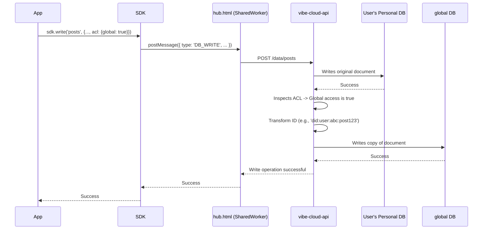

# Phase 0 Design: Live Global Database & Shared Worker

## 1. Abstract

This document outlines a new foundational architecture for data aggregation on the Vibe platform. It supersedes the "Materialized Views" concept in favor of a more robust, real-time solution. The core of this approach is a centralized **Global Database** that contains live copies of all documents with public-facing Access Control Lists (ACLs), updated directly on every `write()` operation. This is complemented by the introduction of a **SharedWorker** on the client-side to ensure efficient resource management.

This design addresses key scalability challenges while providing a solid, extensible foundation for future features.

## 2. Core Components

### 2.1. Client-Side: SharedWorker

To ensure efficient multi-tab operation and prepare for more advanced client-side logic, a `SharedWorker` will be implemented within `hub.html`.

-   **Purpose**: The `SharedWorker` will act as a singleton resource manager for all Vibe-related activities within the same origin.
-   **Responsibilities**:
    -   Managing a single PouchDB instance for local caching, eliminating redundant syncs and listeners from multiple tabs.
    -   Handling all API communication, centralizing requests.
    -   Serving as the foundation for future client-side processing, such as the "Magnetic Feeds" concept.
-   **Benefit**: Reduces CPU, memory, and network overhead when a user has multiple application tabs open.

### 2.2. Server-Side: The Global Database

A new, central CouchDB database, named `global`, will be created within the `vibe-cloud-api`.

-   **Purpose**: To hold a live, aggregated collection of all documents from all users that are explicitly marked as accessible to others via their ACLs.
-   **Mechanism**: This database is populated and maintained in real-time during standard data operations, not by a background batch process.

## 3. Data Flow and Logic

### 3.1. Modified `write()` Operation

The primary change is in the `vibe-cloud-api`'s data writing endpoint (e.g., `/data/:collection`).

1.  A standard `write()` request is received for a user's personal database.
2.  The document is written to the user's personal database as usual.
3.  **After the write, the API inspects the document's ACL.**
4.  **If the ACL permits global access**:
    -   The API transforms the document's ID to prevent collisions (see Section 4.1).
    -   The API writes a copy of the document to the `global` database.
5.  **If an existing document's ACL is updated to remove global access**:
    -   The API deletes the corresponding document from the `global` database.

### 3.2. Modified `read({ global: true })` Operation

The global read operation becomes significantly simpler and faster.

1.  A `read()` request with `{ global: true }` is received.
2.  The API ignores the user's personal database and **queries the `global` database directly.**
3.  Real-time subscriptions (`read()` with a callback) will listen to the `_changes` feed of the `global` database, which is highly efficient.

### 3.3. Architectural Diagram

## 4. Key Architectural Challenges & Solutions

### 4.1. Document ID Collision

**Problem**: Documents from different users might have the same `_id`, which would cause conflicts in the `global` database.

**Solution**: We will enforce unique IDs in the `global` database by creating a composite key. The new `_id` will be a concatenation of the owner's DID and the original document's `_id`.

-   **Original `_id`**: `post123`
-   **Owner's DID**: `did:vibe:user:abc`
-   **Global DB `_id`**: `did:vibe:user:abc:post123`

This format guarantees uniqueness, is predictable, and maintains a clear reference to the document's origin.

### 4.2. Sequencing and Fetching Changes

**Problem**: A common and critical operation will be for clients to fetch only what's new since their last query.

**Solution**: We will leverage CouchDB's native `_changes` feed on the `global` database.

-   The CouchDB `_changes` feed provides a `last_seq` value that represents a point in time in the database's history.
-   Clients can perform a query and receive the current `last_seq`.
-   For subsequent updates, the client can query the `_changes` feed with a `since=<last_seq>` parameter to receive only the documents that have been added or changed since that point.
-   This is a highly efficient, built-in mechanism that perfectly suits the need for chronological updates.

## 5. Future Considerations

This Phase 0 architecture provides a powerful foundation. The `global` database, replicated locally to the client's PouchDB via the SharedWorker, becomes the ideal source for client-side aggregation features like "Magnetic Feeds" to operate on, without needing to iteratively fetch from every user. This design is not a temporary fix, but the first major step in our long-term scalability strategy.
