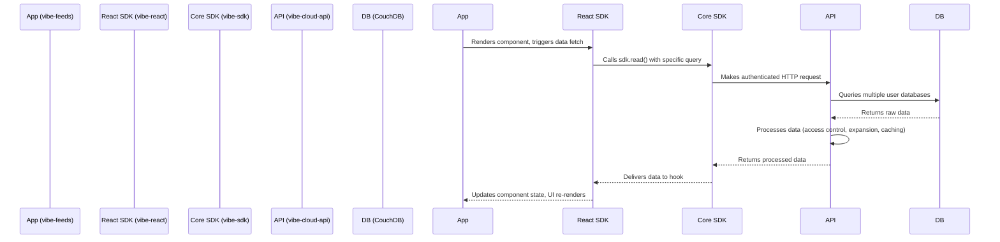

# Vibe Platform Architecture: Enabling Global Aggregated Feeds

This document provides a detailed, technical explanation of how the Vibe platform enables third-party applications to create global, aggregated feeds. We will use the `vibe-feeds` application as a concrete example to illustrate the end-to-end flow, from the frontend React components down to the backend API and database interactions.

The primary goal is to offer a self-contained guide for developers to understand the current implementation, its capabilities, and its limitations, serving as a foundation for future architectural improvements.

## Core Principle: Decentralized Data, Centralized Orchestration

The Vibe platform is built on a hybrid model. User data is decentralized, with each user having their own dedicated CouchDB database. However, the `vibe-cloud-api` acts as a centralized orchestrator, managing identity, authentication, and data access. This model allows for data ownership and portability while providing a secure and simplified API for developers.

## Communication Flow: A High-Level Overview

The creation of a global aggregated feed involves a series of interactions between the following components:

-   **`vibe-feeds` (Application Layer):** A React-based web application built on the Vibe platform.
-   **`vibe-react` (React SDK):** A library that provides React hooks and components to simplify integration with the Vibe platform.
-   **`vibe-sdk` (Core SDK):** A TypeScript library that handles the low-level communication with the `vibe-cloud-api`.
-   **`vibe-cloud-api` (Backend API):** The central service that processes requests, interacts with user databases, and enforces security policies. For now we offer a managed vibe cloud service, in the future users should be able to self-host their backend and these should be able to communicate with each other in a federated network.
-   **`CouchDB` (Database):** The underlying database technology where user data is stored.

The following diagram illustrates the high-level communication flow in **Standalone Mode**, which is the current mode of operation for `vibe-feeds`.



---

## Standalone Mode: A Deep Dive

In Standalone Mode, the application communicates directly with the `vibe-cloud-api` for all data operations. This is the simpler of the two modes and is the one currently used by `vibe-feeds`.

### 1. The Application Layer (`vibe-feeds`)

The process begins in the React components of the `vibe-feeds` application.

#### `VibeProvider.tsx`: Initializing the SDK

The root of the application is wrapped in a `VibeProvider`, which initializes the Vibe SDK with a manifest file. This manifest contains the configuration for the application, including the API URL and the `useHub` flag.

_File: `apps/vibe-feeds/app/components/VibeProvider.tsx`_

```typescript
"use client";

import { VibeProvider as VibeProviderReact } from "vibe-react";
import type { ReactNode } from "react";

import { appManifest } from "../lib/manifest";

export function VibeProvider({ children }: { children: ReactNode }) {
    return <VibeProviderReact config={appManifest}>{children}</VibeProviderReact>;
}
```

_File: `apps/vibe-feeds/app/lib/manifest.ts`_

```typescript
import { VibeManifest } from "vibe-sdk";

// ...

export const appManifest: VibeManifest = {
    // ...
    apiUrl: process.env.NEXT_PUBLIC_API_URL || "http://localhost:5050",
    useHub: false, // This is the key to enabling Standalone Mode
    // ...
};
```

#### Writing Data: `CreatePost.tsx`

The `write` operation is used to create new documents. The `vibe-feeds` application uses this to create new posts via the `CreatePost.tsx` component.

_File: `apps/vibe-feeds/app/components/CreatePost.tsx`_

```typescript
"use client";

import { useState } from "react";
import { useVibe } from "vibe-react";

export function CreatePost() {
    const { write, user } = useVibe();
    const [content, setContent] = useState("");

    const handleCreatePost = async () => {
        if (!user) return;

        const post = {
            content,
            author: {
                did: user.did,
                ref: "profiles/me",
            },
            createdAt: new Date().toISOString(),
        };

        await write("posts", post);
        setContent("");
    };

    // ...
}
```

#### Reading Data: `Feed.tsx`

The `Feed.tsx` component is responsible for fetching and displaying posts. It uses the `read` function from the `useVibe` hook with the `global: true` parameter to fetch the aggregated feed.

_File: `apps/vibe-feeds/app/components/Feed.tsx`_

```typescript
"use client";

import { useEffect, useState } from "react";
import { useVibe } from "vibe-react";
// ...

export function Feed({ feedId }: { feedId: string }) {
    const { read, isLoggedIn, user } = useVibe();
    const [posts, setPosts] = useState<any[]>([]);

    useEffect(() => {
        if (!isLoggedIn || !user) return;

        // ...

        if (feedId === "discover") {
            const subscriptionPromise = read("posts", { global: true, expand: ["author"] }, (result) => {
                if (result.ok && result.data) {
                    setPosts(result.data);
                }
            });
        }

        // ...
    }, [isLoggedIn, user, read, feedId]);

    // ...
}
```

### 2. The SDK Layer (`vibe-sdk`)

The SDK abstracts the communication with the backend.

#### `read` vs. `readOnce`: Real-Time Subscriptions vs. One-Time Queries

The Vibe SDK provides two methods for reading data: `read` and `readOnce`.

-   **`readOnce`**: This method performs a one-time `GET` request to the `vibe-cloud-api` and returns the results. It is suitable for data that does not change frequently.
-   **`read`**: This method, used in `Feed.tsx`, establishes a real-time subscription. It first performs an initial query (like `readOnce`) and then keeps a connection open to the database's `_changes` feed via the API. This allows the server to push updates to the client as they happen, enabling real-time functionality.

### 3. The Backend API Layer (`vibe-cloud-api`)

This is where the core logic for data operations resides. The `vibe-cloud-api` receives requests from the `vibe-sdk` and processes them in the `DataService`.

#### `data.ts`: The `write` Method

The `write` method handles the creation of new documents. It assigns a unique ID if one is not provided and inserts the document into the user's database.

_File: `apps/vibe-cloud-api/src/services/data.ts`_

```typescript
export class DataService {
    // ...
    async write(collection: string, data: any, user: JwtPayload) {
        await this.reauthenticate();
        const db = this.getDb(user.instanceId);
        const itemsToProcess = Array.isArray(data) ? data : [data];

        const docs = await Promise.all(
            itemsToProcess.map(async (doc) => {
                if (!doc._id) {
                    doc._id = `${collection}/${Date.now()}-${Math.random().toString(16).slice(2)}`;
                } else {
                    // ... logic to handle updates to existing documents ...
                }
                doc.collection = collection;
                return doc;
            })
        );

        const response = await db.bulk({ docs });
        return response;
    }
    // ...
}
```

#### `data.ts`: The `readOnce` Method

The `readOnce` method is the entry point for all read requests. When the `global` parameter is true, it executes the logic for the aggregated feed.

_File: `apps/vibe-cloud-api/src/services/data.ts`_

```typescript
export class DataService {
    // ...
    async readOnce<T extends Document>(collection: string, query: any, user: JwtPayload): Promise<ReadOnceApiResponse<T>> {
        await this.reauthenticate();
        const { expand, maxCacheAge, global, ...selector } = query;

        if (global) {
            const dbNames = await this.getAllUserDbNames();
            const allDocs: T[] = [];

            for (const dbName of dbNames) {
                try {
                    const db = this.couch.use(dbName);
                    const result = await db.find({ selector: { ...selector, collection: collection } });
                    for (const doc of result.docs) {
                        if (await this.verifyAccess(doc, user, "read", dbName)) {
                            allDocs.push(doc as unknown as T);
                        }
                    }
                } catch (error) {
                    console.error(`Error querying database ${dbName}:`, error);
                }
            }

            if (expand && expand.length > 0) {
                const docs = await this._expand(allDocs, expand, user, maxCacheAge);
                return { docs: docs as T[] };
            }

            return { docs: allDocs };
        } else {
            // ... logic for non-global queries
        }
    }
    // ...
}
```

This code demonstrates the current approach:

1.  **`getAllUserDbNames()`**: Get a list of all user databases.
2.  **Loop and Query**: Iterate through each database and query for documents.
3.  **`verifyAccess()`**: For each document, check if the current user has read access.
4.  **Aggregate**: Collect all accessible documents into a single array.
5.  **`_expand()`**: If requested, expand any `DocRef`s in the documents.

#### `_expand` and Caching

The `_expand` method replaces `DocRef`s with the actual document content and includes a caching mechanism to reduce redundant database queries.

_File: `apps/vibe-cloud-api/src/services/data.ts`_

```typescript
export class DataService {
    // ...
    private async _expand(docs: any[], expand: string[], currentUser: JwtPayload, maxCacheAge?: number) {
        const currentUserDb = this.getDb(currentUser.instanceId);
        const promises = docs.map(async (doc) => {
            const expandedDoc = { ...doc };
            for (const field of expand) {
                const ref = doc[field] as DocRef;
                if (!ref || !ref.did || !ref.ref) continue;

                // ... Caching logic ...

                const remoteUser = await this.identityService.findByDid(ref.did);
                if (remoteUser) {
                    const remoteDb = this.getDb(remoteUser.instanceId);
                    try {
                        const freshDoc = await remoteDb.get(ref.ref);
                        expandedDoc[field] = freshDoc;
                        // ... Update cache ...
                    } catch (error) {
                        // ...
                    }
                }
            }
            return expandedDoc;
        });
        return Promise.all(promises);
    }
    // ...
}
```

#### `verifyAccess` and Security

The `verifyAccess` method is a critical component of the security model. It checks the `acl` (Access Control List) of a document to determine if a user has the required permissions.

_File: `apps/vibe-cloud-api/src/services/data.ts`_

```typescript
export class DataService {
    // ...
    private async verifyAccess(doc: any, user: JwtPayload, permission: "read" | "write" | "create", dbName: string): Promise<boolean> {
        const docInstanceId = dbName.replace("userdb-", "");
        if (docInstanceId === user.instanceId) {
            return true; // User always has access to their own documents
        }

        const acl = doc.acl as Acl;
        if (!acl) {
            return false;
        }

        // ... Logic to check acl rules against user's DID and certificates ...
    }
    // ...
}
```

---

## Hub Mode: A High-Performance Alternative

While not currently used by `vibe-feeds`, Hub Mode represents a significant architectural alternative for building high-performance, real-time applications on the Vibe platform. In this mode, the `vibe-sdk` loads a sandboxed `hub.html` iframe into the application. This Hub acts as a local data proxy, maintaining a PouchDB instance that performs a live, two-way sync directly with the user's personal CouchDB database. This reduces latency and enables offline capabilities by serving data from the local cache first.

---

## Architectural Challenges and Implications

The current implementation of the global aggregated feed, while functional, presents several challenges for scalability and performance:

1.  **N+1 Query Problem:** The `vibe-cloud-api` has to query every single user's database to construct the feed. This is inefficient and will not scale as the number of users grows.
2.  **Performance:** The latency of the global feed request is directly proportional to the number of users and the amount of data they have.
3.  **Lack of Discovery:** The current model only allows for aggregating data that is already known and accessible. It does not provide a mechanism for discovering new, public content from users that the current user has no prior relationship with.

Solving these challenges is the key to evolving Vibe from a protocol for federated data access into a platform for truly decentralized, collaborative applications. Future work will need to focus on:

-   **Decentralized Indexing:** Creating a global or partial index of all public posts without a central server having to query every database.
-   **Peer-to-Peer Content Discovery:** Enabling clients to work together to build and share the aggregated feed.
-   **Query Aggregation and Filtering:** Developing a decentralized query engine that can operate over the distributed index.

For third-party developers, the current implementation provides a simple way to get started with aggregated feeds, but they should be aware of the performance implications. As the Vibe platform evolves, developers will be able to leverage more advanced features to build more scalable and performant applications.
